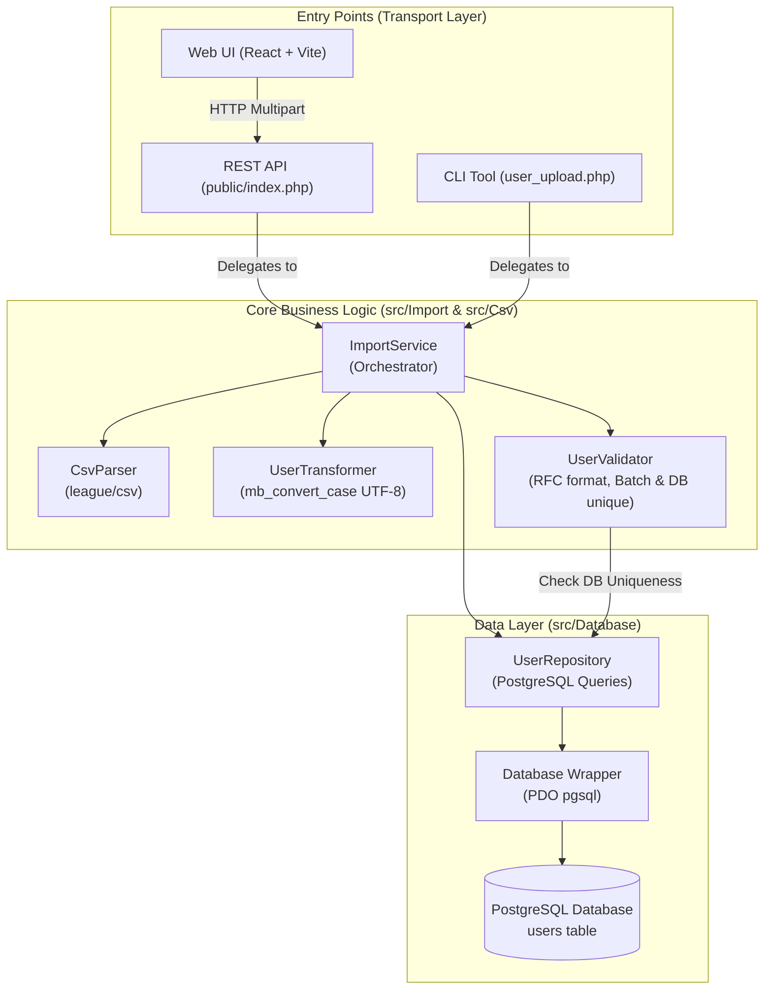

# 🏛️ System Architecture & Engineering Decisions

This document outlines the architecture, component design, and engineering decisions implemented in the **Moodle User Import Application**.

---

## 📐 Architecture Overview

The system is designed following **Clean Architecture** and the **Single Responsibility Principle (SRP)**. The core business logic is completely isolated from presentation and transport layers (HTTP REST API and CLI).

---

## 🧩 Component Breakdown

### 1. Data Ingestion & Parsing (`MoodleImportApp\Csv\CsvParser`)
- Wraps `League\Csv\Reader` with header offset detection.
- Skips fully empty rows gracefully.
- Normalizes raw field inputs for consumption by the domain layer.

### 2. Transformation Pipeline (`MoodleImportApp\Import\UserTransformer`)
- **Title-Case Transformation:** Uses `mb_convert_case(..., MB_CASE_TITLE, 'UTF-8')` to properly capitalize international characters in names and surnames.
- **Email Normalization:** Converts email strings to lowercase via `mb_strtolower(..., 'UTF-8')` to ensure consistent case-insensitive handling.

### 3. Validation Rules (`MoodleImportApp\Import\UserValidator`)
- **Required Fields:** Ensures `name`, `surname`, and `email` are non-empty.
- **Email Format:** Validates syntax using PHP's native `filter_var($email, FILTER_VALIDATE_EMAIL)`.
- **In-Batch Duplicate Check:** Tracks emails processed within the current file session to catch duplicates occurring in the same CSV upload.
- **Database Duplicate Check:** Queries `UserRepository::isEmailUnique()` to prevent primary key / unique constraint collisions.

### 4. Persistence Layer (`MoodleImportApp\Database\UserRepository`)
- Uses parameterized PDO prepared statements (`:name`, `:surname`, `:email`) to completely protect against SQL Injection without manual string escaping.
- Uses PostgreSQL-native `RETURNING id` query clause to reliably retrieve inserted record identifiers.

---

## 🎯 Key Engineering Decisions

| Requirement / Challenge | Solution & Rationale |
| :--- | :--- |
| **Shared Business Logic** | Both CLI and Web API call `ImportService`, guaranteeing identical parsing, transformation, and validation outcomes across both interfaces. |
| **Double-Escaping Prevention** | Removed redundant `pg_escape_string()` calls. Relying strictly on PDO parameter binding ensures special characters like `"O'Brien"` are stored faithfully. |
| **Reliable Test Assertions** | Replaced PHP `assert()` (which is disabled under production `zend.assertions=-1`) with exception-based assertions and explicit exit codes (`exit(1)` on failure). |
| **Lightweight Dependencies** | Removed external `vlucas/phpdotenv` dependency in favor of a lean, native `.env` parser in `Config.php`. |
| **Dry-Run & Preview Support** | Validation occurs prior to transaction commits, allowing users to inspect valid/invalid rows in the UI or via CLI before writing to the database. |
